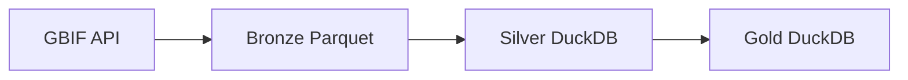
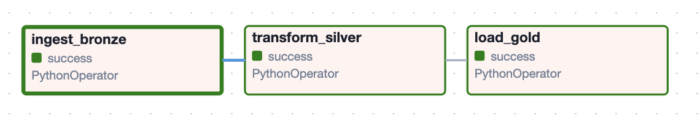

<div align="center">
    
</div>

# Bird Observations Pipeline

## Overview

This pipeline automatically ingests bird observation data from the GBIF API  for Lower Silesia, Poland, transforms it through a Medallion Architecture  (Bronze -> Silver -> Gold), and loads it into DuckDB for analytical queries. Orchestrated by Apache Airflow and fully containerized with Docker.

This project grew out of my postgraduate Data Science studies at WSB Merito Wrocław (Data Science), where I worked with Global Biodiversity Information Facility (GBIF) bird data for the first time. I realized I was more excited about building the pipeline than analyzing the results...so I rebuilt it from scratch, this time focused on data engineering.

## Prerequisites

- [Docker Desktop](https://www.docker.com/products/docker-desktop)
- Git

## Architecture

Data flows through three layers of the Medallion Architecture:



- **Bronze** — raw data ingested from GBIF API, stored as Parquet
- **Silver** — cleaned and validated data in DuckDB (`silver_birds` table)
- **Gold** — analytical layer in DuckDB (`gold_birds` table), ready for querying




## Stack

| Tool  | Usage |
|-------|---------|
| Python | Pipeline logic |
| Apache Airflow| Orchestration and scheduling |
| DuckDB| Database (Silver and Gold layers)|
| Docker, Docker compose| Containerization |
| Parquet| Bronze storage format |
| GBIF API | Bird observation data source |

## Project Structure
```
bird-pipeline/
├── dags/
│   └── bird_pipeline_dag.py    # Airflow DAG - full pipeline definition
├── sql/
│   └── analysis.sql            # Example analytical SQL queries
├── Dockerfile.airflow          # Custom Airflow image with DuckDB
├── docker-compose.yml          # All services definition
└── README.md
```
## How to Run

1. Clone the repository: `git clone https://github.com/debkul7/bird-pipeline.git`.
2. Enter the project folder: `cd bird-pipeline`.
3. Run `docker compose up`.
4. Open Airflow UI at `http://localhost:8080`.
5. Log in with `airflow` / `airflow`.
6. Trigger the `bird_pipeline` DAG manually.

## Data Source

The data comes from the [Global Biodiversity Information Facility](https://www.gbif.org/) (GBIF), one of the largest open biodiversity data platforms in the world.

**Query parameters:**
- Class: Aves (birds)
- Country: Poland
- Region: Lower Silesia (Dolnośląskie)
- Year: 2024
- Limit: 300 records per run

## Notes

This project is designed as a local development environment to demonstrate 
data engineering concepts. In a production setup, this pipeline would differ 
in several ways:

- **Storage** — Bronze layer would be stored in cloud object storage 
  (Example: Google Cloud Storage or Azure Data Lake)
- **Database** — Gold layer would use a cloud data warehouse 
  (Example: BigQuery or Snowflake) instead of DuckDB
- **Orchestration** — Airflow would run on a managed service 
  (Example: Google Cloud Composer) rather than locally via Docker
- **Scale** — GBIF API limit would be removed to process full datasets

## Credits
Bird icon by [Icons8](https://icons8.com)
